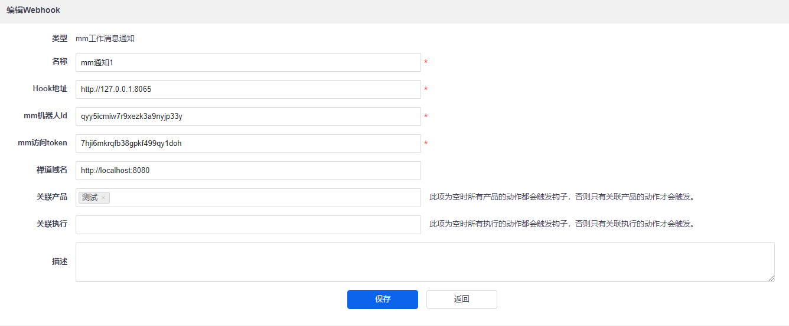
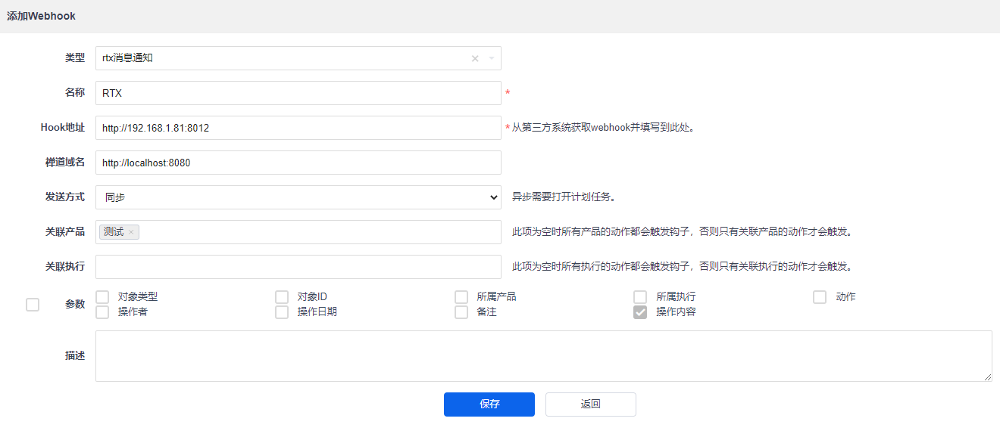

# zentao_webhook
禅道 webhook 二次开发，支持 RTX、mattermost 消息通知。

禅道版本：15.4

## 安装
将本项目的 ext 文件夹复制到禅道项目的 `module/webhook` 目录，例如: `/opt/zbox/app/zentao/module/webhook`。

## 添加 webhook
- mattermost webhook

- RTX webhook

